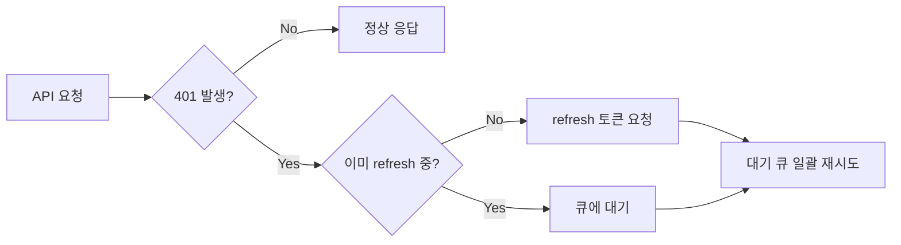

# 제일택배사 시스템 재구축 - 프론트엔드

소규모 택배사 운영 시스템 프론트엔드. Spring Boot 백엔드와 REST API 연동.

---

## 기술 스택

- **Frontend**: React 18.3.1, TypeScript 5.6.3, Vite
- **API**: Axios (JWT 자동 갱신, 동시 401 처리)
- **Server State**: TanStack Query
- **UI**: Shadcn/UI, Tailwind CSS
- **Grid**: IBSheet8
- **Infra**: Docker, Jenkins, nginx

---

## 프로젝트 개요

| 항목 | 내용 |
|------|------|
| 기간 | 2025.07 ~ 2026.02 (약 7개월) |
| 팀 구성 | 프론트 본인 + 백엔드 1인 |
| 도메인 | 운송정보 입력 / 정산 / 청구서 관리 |

---

## 참고 사항

- 이 저장소는 포트폴리오 목적으로 코드 구조와 구현 내용을 공개합니다.
- 실제 운영 환경(백엔드 API)과 분리되어 있어 별도 환경 구성 없이는 직접 실행할 수 없습니다.
- 빌드 환경(참고): Node.js 20.x, npm, Vite
- API 주소 등 설정값은 `.env`에서 관리되며, 보안상 저장소에는 포함하지 않았습니다 (`VITE_API_BASE_URL`).

---

## 주요 기능

### 인증

- JWT AccessToken / RefreshToken 연동
- Axios 인터셉터 기반 토큰 자동 갱신
- 동시 401 발생 시 큐잉 처리 (1회만 refresh 수행)
- 로그아웃 시 React Query 캐시 초기화

### 청구서 관리
- IBSheet8 그리드 기반 청구서 목록 조회
- 업체별 재계산 / 메일 재전송
- 상세 청구서 PDF 다운로드 (Blob 처리, RFC 5987 파일명 인코딩)
- 세금계산서 ZIP 다운로드

### 운송 기능

- 운송정보 입력 / 배송체크 / 도착분 / 운송장 선등록
- 화주별 정산서 / 화주별 상세

### 업체/회원 관리
- 업체 등록 / 수정 / 삭제
- 회원관리 / 공지사항

---

## 트러블슈팅

### 동시 401 무한 refresh 루프
> API 요청 시, 여러 요청이 동시에 401을 받으면 refresh가 중복 호출되는 문제 발생 → isRefreshing 플래그와 failedQueue로 큐잉하여 1회만 refresh 수행 후 대기 요청을 일괄 재시도하도록 개선

- **문제**: 여러 요청 동시 401 시 refresh 중복 호출 발생
- **해결**: isRefreshing 플래그 + failedQueue 배열로 큐잉, 1회만 refresh 수행 후 대기 요청 일괄 재시도

### IBSheet 그리드 중복 오픈 오류
> 모달에서 IBSheet 그리드를 재오픈할 때, 기존 시트가 제거되지 않아 충돌 발생 → 모달 열림/닫힘 시점에 dispose + removeSheet 처리를 추가해 충돌 해결

- **문제**: 모달 재오픈 시 기존 시트 미제거로 충돌 발생
- **해결**: 모달 열림/닫힘 시 IBSheet dispose + loader.removeSheet 처리

### 화주별 내역 무한 리렌더링
> 화주별 내역 페이지에서, useEffect 의존성 배열 설정 오류로 무한 렌더링 발생 → 의존성 배열을 수정해 정상화

- **문제**: shipper-details.tsx useEffect 의존성 배열 오류로 무한 렌더링
- **해결**: useEffect 의존성 배열 수정
